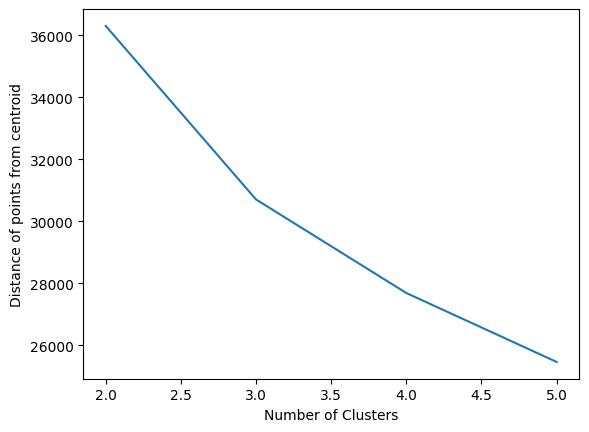
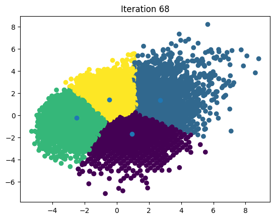

# K-Means-Clustering

K-means clustering is a method for grouping n observations into K clusters. It uses vector quantization and aims to assign each observation to the cluster with the nearest mean or centroid, which serves as a prototype for the cluster. Originally developed for signal processing, K-means clustering is now widely used in machine learning to partition data points into K clusters based on their similarity. The goal is to minimize the sum of squared distances between the data points and their corresponding cluster centroids, resulting in clusters that are internally homogeneous and distinct from each other. *- (credit: Analytics Vidhya)*

Here I present K means clustering from scratch ( without using sklearn, and numpy).

## Motivation

Understand internal working of Clustering Algorithm.

## Requirements

1. pandas
2. sklearn **(just to PCA for dimensionality reduction and visualize the data in 2-D)**
3. matplotlib 

## Execution:

1. Run the notebook block by block and play with the number of clusters.
2. Data: [Kaggle archive/players_22.csv]https://www.kaggle.com/datasets/stefanoleone992/fifa-22-complete-player-dataset/

I also implemented the Elbow method to look for number of clusters.

  
   

After getting the right number of clusters we can just group and plot the data using PCA.

  
   

## References

1. Dataquest: K-means Clustering From Scratch In Python [Machine Learning Tutorial]
2. Emma Ding: From Scratch: How to Code K-Means in Python (No Sklearn) for Machine Learning Interviews!